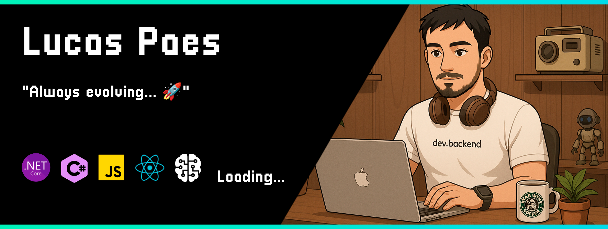
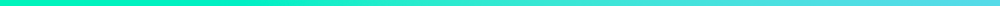

  

<h3 align="center">
  Software Developer • Tech enthusiast • Gamer
</h3>

  
   
  
  

 

<strong> > About me: </strong>

-  Hello! My name is Lucas Paes and I am a Software Developer and Graduate in Systems Analysis and Development.  
-  My current goal is to become a Software Architect and a .NET specialist. 
-  My main stack is .Net C#. 
-  I love watching how technology evolves and I'm passionate about being part of that journey. I want to be surrounded by people and companies that strive to stand out in the world through innovation.  

 

<strong> > My Stack: </strong>

 

<strong> > Contact Me: </strong>

  

 

<strong> > My Posts: </strong>

<!-- BLOG-POST-LIST:START -->
- 👨‍💻 <a href='https://dev.to/vaivoa/mercado-financeiro-onboarding-para-devs-i27'>Mercado Financeiro: Onboarding para Devs.</a> | 🏷️ **Tags:** finanças, investimento, b3, vaivoa | 📅 **Data**: 22/11/2021  
- 🚀 <a href='https://dev.to/lucastmp/mercado-financeiro-onboarding-para-devs-384d'>Mercado Financeiro: Onboarding para Devs.</a> | 🏷️ **Tags:** vaivoa, finanças, investimento, b3 | 📅 **Data**: 22/11/2021  
- 🔥 <a href='https://dev.to/vaivoa/c10-e-aspnet-6-oque-esperar-dessa-dupla-14k6'>C#10 e ASP.NET 6, oque esperar dessa dupla?</a> | 🏷️ **Tags:** csharp, programming, vaivoa, net6 | 📅 **Data**: 04/11/2021  
- 👨‍💻 <a href='https://dev.to/lucastmp/c10-e-aspnet-6-oque-esperar-dessa-dupla-3oc'>C#10 e ASP.NET 6, oque esperar dessa dupla?</a> | 🏷️ **Tags:** csharp, programming, vaivoa, net6 | 📅 **Data**: 22/10/2021  
<!-- BLOG-POST-LIST:END -->
  

 

<label><b>Total profile views: &ensp;&ensp;</b></label>

  

